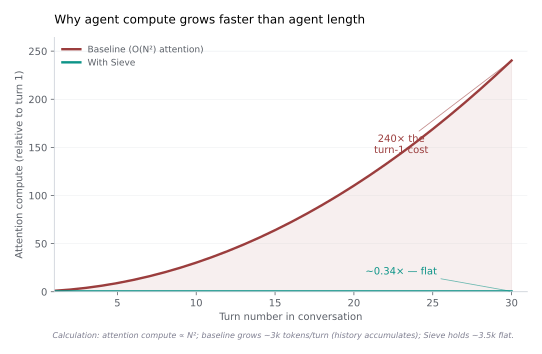
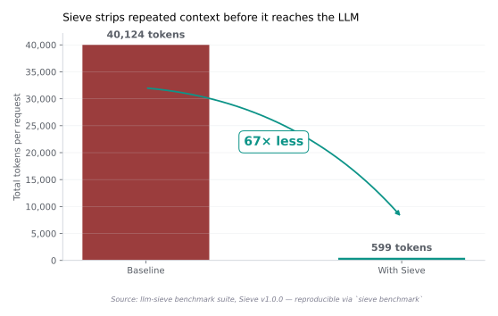
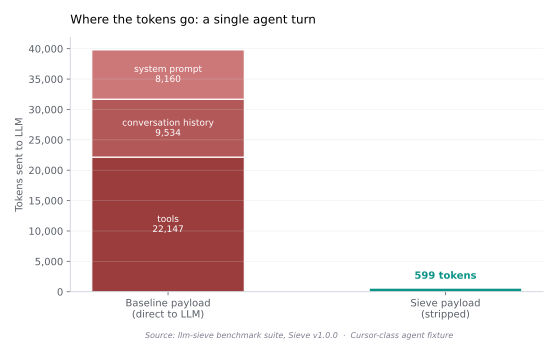
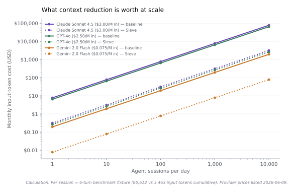
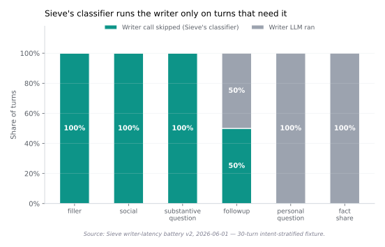

# Compute is the bottleneck. Tokens are just the price tag.

*Applies to: Sieve v1.0.x*

There are three forces shaping what AI gets to exist in 2026, and
only one of them gets talked about properly.

The first is the model. Which lab has the best one, what it can do,
who can use it. This gets most of the press.

The second is the application. Which agent product works, which
codebase you can let Cursor loose on, whether your CRM has Copilot
yet. This gets most of the funding.

The third is **the compute the first two run on**. There isn't
enough of it. There hasn't been enough of it since GPT-4. Every
price you've ever seen for an LLM token is a passthrough of a
scarcity that begins in a TSMC fab in Hsinchu and ends on your
invoice.

This post is about that third force. It is also about Sieve, which
is the small lever it sits behind. We won't claim Sieve fixes the
compute bottleneck — nothing currently in the field does, and the
honest framing of what Sieve contributes is more interesting than
the dishonest one.

<!-- more -->

## The bottleneck nobody talks about as a bottleneck

When you read "AI is constrained by GPUs" in the trade press, the
implication is usually a temporary supply issue — wait six months,
Nvidia ships more cards, problem solved. This is wrong in a way
that matters.

The actual constraint isn't silicon. It's **advanced packaging** —
specifically the chip-on-wafer-on-substrate (CoWoS) process at
TSMC that bonds the GPU die to its high-bandwidth memory stack.
CoWoS capacity has been the rate-limiting step for H100, H200, and
B200 supply since 2023. [TSMC's own guidance][tsmc-cowos] is that
capacity is being roughly doubled year-on-year through 2026, but
"doubling" from a base that's still drastically short of demand
doesn't close the gap; it slows the rate at which the gap grows.

This shows up in the capex numbers. Microsoft, Meta, Google, and
Amazon collectively guided to **>$300 billion in 2025 capital
expenditure**, with the majority going to AI infrastructure
([Bloomberg coverage][bloomberg-capex],
[Reuters][reuters-capex]).
That's an investment rate large enough to reshape the global
semiconductor industry, and analysts still expect demand to outrun
supply through at least 2027 ([Morgan Stanley][ms-cowos],
[Bain & Co][bain-genai-capex]).

The point isn't that AI infrastructure is expensive. The point is
that **compute is the binding constraint on the rate at which AI
can scale at all**. Models can get smarter; applications can find
new fits; but if the underlying compute isn't there, neither moves.

If you've ever wondered why every frontier LLM hits a rate limit
when you actually try to use it in anger — why your enterprise tier
has soft ceilings on tokens-per-minute, why your local Ollama
install slows down with longer contexts even on good hardware,
why your monthly Claude bill creeps up faster than your usage —
it's because that capacity ceiling is real and it's being passed
to you.

## Tokens aren't a unit. They're a tax.

Per-token pricing looks like a clean abstraction. You send tokens,
you pay for tokens, you can budget. The reality is messier.

A token is **a unit of work the GPU did**. For a transformer, that
work has two costs: a constant per-token cost (the matrix multiply
through the model's weights) and a per-token cost that grows with
the **length of context already in the prompt**, because the
attention mechanism relates every new token to every prior one.
The compute cost of attention scales with the **square of the
context length** — a well-documented property of the transformer
architecture since [Vaswani et al. (2017)][attention-paper].

This means a token at position 50,000 in a long-context prompt
costs the GPU materially more than a token at position 500. The
LLM provider absorbs this cost up to a point. Above that point,
they pass it through. That's exactly what the recent **tiered
long-context pricing** is: at the time of writing, Anthropic charges
premium rates above 200k tokens, OpenAI's long-context tiers on
GPT-4o and o-series step up similarly, and Google offers explicit
"long context" pricing on Gemini's 2M-token window.

These steps aren't arbitrary. They're the points where the per-
token compute cost bends faster than the headline price covers. The
providers aren't being greedy when they tier pricing at long
context — they're being honest about the underlying physics. The
GPU is doing more work; you should pay more.

The same pattern shows up in [latency curves][openai-latency] and
[batching throughput][nvidia-throughput]. At low context, providers
can pack many requests onto one GPU; at high context, they can't,
and per-request compute climbs. **Pricing reflects this. Latency
reflects this. Throughput reflects this.**

If you're paying tokens, you're paying compute. If you're paying
compute, you're paying a scarce resource. If you can change the
number of tokens you ship without changing what you get back —
that's the lever.

## Why this hurts agents more than chat

A single ChatGPT-style conversation might involve 5,000 input
tokens over its lifetime. A typical user asks a few questions,
the model responds, the session ends. Compute cost is small;
attention's quadratic scaling barely registers.

An **agent loop** is structurally different. On every turn, the
agent re-ships:

- The system prompt (200-2,000 tokens, repeated verbatim)
- The tool schemas (5,000-20,000 tokens for a Cursor-class agent
  with many tools, repeated verbatim)
- The conversation history (everything before this turn, growing
  monotonically)
- The current user message (small)

Items 1 and 2 are constants the agent ships every turn because the
model is stateless. Item 3 is what ruins your bill.

A real Cursor session running for an hour can easily reach 30+
turns. At turn 30, the agent isn't sending 6,000 tokens like it
did at turn 1 — it's sending 60,000 or more, mostly the prior 29
turns being re-shipped on each request because the model has no
memory of them.

If costs were linear, this would mean a 10× bill at turn 30. They
aren't. The attention cost is quadratic in context length, so the
compute the GPU actually expends climbs much faster:

{ .sieve-blog-chart }

By turn 30 of a typical agent loop, a single turn requires roughly
**240 times** the compute of the first turn. The user's behaviour
hasn't changed; the agent's job hasn't changed; the cost has
quietly climbed by two orders of magnitude.

This is the worst possible workload shape for a compute-constrained
world. Agents are everywhere now — Cursor, Cline, Devin, Claude
Code, GitHub Copilot's agent mode, every enterprise CRM with an
"AI assistant" — and they all share this structural pathology.

The growth of agents *should* be the most exciting thing happening
in software in 2026. Instead, it's running headlong into the
hardest physical constraint the industry has.

## The three families of fixes

You can attack the agent-compute problem in three places. Each has
real proponents and real costs.

### 1. Build more compute

This is what hyperscaler capex is. Build more datacentres, fund
more CoWoS expansion, design better GPUs, work on alternative
silicon (Groq's LPUs, Cerebras's wafer-scale chips, Google's TPUs,
custom Meta silicon).

**What it costs:** capital on the order of hundreds of billions a
year, multi-year lead times, and the underlying constraint
(packaging capacity, energy supply, fab capacity) doesn't yield to
money — it yields to physical buildout. Even at full capex velocity,
the structural shortfall is expected to persist through 2027.

**Who can pull this lever:** Nvidia, TSMC, the hyperscalers, a
handful of national governments. Not you.

### 2. Make the model itself cheaper per token

Sparse attention, mixture-of-experts, sub-quadratic attention
alternatives (Mamba, RetNet, hybrid models), quantisation,
distillation. Real progress here, real results — DeepSeek-V3
showing that a frontier-grade model can be trained on
significantly cheaper compute is a 2025 milestone that hasn't
fully landed yet in industry psychology.

**What it costs:** training cycles measured in months, accuracy
trade-offs that have to be carefully managed, and even when it
works, the savings accrue to *the people running inference*, not
necessarily to you as a user.

**Who can pull this lever:** frontier model labs, serious open-
source teams. Not you.

### 3. Change what the agent ships to the model

This is the layer that hasn't been a serious field of study until
very recently. The question is: of the 60,000 tokens an agent
sends to the LLM at turn 30, **how many of them actually matter
for what the model is being asked to do on this turn?**

The honest answer is "very few." The tool schemas are constants
the model has memorised within the first few turns. Most of the
conversation history isn't relevant to the current question. The
system prompt's policy clauses are static. The user's actual
question is a few hundred tokens at most.

If you could ship only what mattered — strip the static repetition,
retrieve only the relevant history, lean the payload before it
hits the LLM — the per-turn compute drops by a factor that's not
proportional to the token reduction, but **quadratically larger**
because of how attention scales.

**Who can pull this lever:** anyone. Right now, today, with no
hardware purchase, no model retraining, no provider coordination.
You change the shape of your workload. The savings are immediate
and they accrue directly to you.

This is the lever Sieve is built around.

## What "less work for the same work" looks like in practice

To make this concrete: Sieve's published benchmark fixture is a
Cursor-class agent payload — system prompt, tool schemas, a
short conversation. Running it through Sieve's pipeline produces
a token count an order of magnitude lower than the raw payload.

{ .sieve-blog-chart }

The benchmark is reproducible — anyone with Sieve installed can
run `sieve benchmark` and get the same numbers on their own
hardware. The 67× headline isn't the floor and isn't the ceiling.
Across the broader range of architectures and contexts in our
[published evaluation][sieve-readme], the **floor across tested
configurations is roughly 95% token reduction**.

It's worth understanding where that reduction comes from. The
benchmark payload decomposes like this:

{ .sieve-blog-chart }

The biggest single component is **tool schemas** — about 22,000
tokens of JSON-Schema declarations describing what every tool the
agent can call accepts and returns. These are static. The agent
ships them every turn because the model is stateless and won't
remember them. Sieve sees that the model doesn't need the full
schema set on most turns — it just needs to know which tools
exist and roughly what they do — and ships only what's needed.

The second biggest is **conversation history** — about 9,500
tokens of prior turns. Sieve's encrypted local store has all of
it. Sieve retrieves the parts the model needs for this turn and
omits the rest.

The system prompt — 8,000 tokens — gets the same treatment.
Policy clauses the model has internalised get trimmed. Constants
get reduced to references. The 8,000 becomes a few hundred.

**The model gets a much smaller, much sharper prompt. It produces
the same answer. The compute it consumed in producing that answer
is dramatically less.**

That's the lever. Now we should talk about what it's actually
worth.

## What it costs (when you pay tokens)

If you're using a hosted LLM — Claude, GPT-4o, Gemini, anything
through an API — your bill is a direct function of the input-token
count multiplied by the per-token rate.

For a single agent session at the 6-turn benchmark fixture (85,612
baseline input tokens cumulative vs 3,463 with Sieve), Sieve saves
about 82,000 input tokens per session. At Claude Sonnet 4.5's
$3/million input rate, that's $0.25 saved per session. Not a
revelation in isolation.

But agents don't run as one session. They run as **many sessions
per day**, across teams, across users, across automation runs. And
the math compounds:

{ .sieve-blog-chart }

At 1,000 sessions per day — within reach for a small engineering
team running Cursor or Claude Code with any seriousness — the
**monthly delta is approximately $7,500 on Sonnet, $6,200 on
GPT-4o, $190 on Gemini Flash**.[^pricing-note] At 10,000 sessions
per day — within reach for any enterprise rolling agents out
across an organisation — those numbers become **$75,000, $62,000,
and $1,900 per month** respectively.

[^pricing-note]: All numbers are per-session input-token cost only,
using the benchmark fixture totals (85,612 baseline vs 3,463
Sieve), provider-published rates as of 2026-06-09, and 30 days
per month. Output-token cost is held constant between conditions —
Sieve changes what the model sees, not what it says. Your actual
savings depend on agent shape, session length, conversation
density, and whether you pay tiered long-context rates. The
benchmark fixture is an honest sample, not a guarantee.

These aren't theoretical numbers. They're the linear consequence
of the published per-session reduction multiplied by realistic
operational volumes. Engineering teams running agent-heavy
workflows are quietly absorbing token bills in this range right
now. Most of them haven't yet noticed it's a line item worth
attacking.

## What it costs (when you self-host)

If you run your own LLM — Ollama, vLLM, LM Studio, any GPU-local
setup — you don't pay tokens. You pay GPU time, electricity, and
the marginal opportunity cost of compute you could have used
elsewhere.

The reduction story here is structurally the same but the
denomination changes. Instead of dollar savings, you get:

**Latency reduction.** Sieve's published numbers show
**3-7× lower per-turn latency on follow-up turns** for self-hosted
models. The same Qwen3-30B that takes 12 seconds to produce a
response from a turn-30 baseline prompt produces the same response
in 2-3 seconds from a Sieve-leaned prompt, because the model isn't
grinding through 60,000 tokens of attention.

**Throughput uplift.** A GPU serving lean prompts can handle
materially more concurrent agent sessions than the same GPU
serving baseline prompts. The exact factor depends on batching
and memory pressure, but the direction is consistent: fewer
tokens means more concurrent users.

**Battery and energy.** For users running agents on local
hardware — including the growing population of developers running
Cursor against local Ollama for privacy reasons — every token
that doesn't get computed is a watt-hour saved. On a M-series
MacBook, this is the difference between an agent session that
drains 12% of battery and one that drains 2%.

**Hardware longevity.** GPU-local inference produces heat. Less
context, less heat, less thermal throttling, less wear. This is a
minor benefit at the single-user scale and a significant one at
fleet scale.

The compute that Sieve doesn't make the LLM do is **available for
other work**. That's the form the saving takes when you own the
silicon.

## Sieve's own overhead — the honest accounting

It would be dishonest to talk about compute savings without
accounting for the compute Sieve itself uses.

The proxy runs five things on its hot path:

1. **A classifier** (sub-millisecond regex pass) decides whether
   the inbound turn contains anything worth extracting facts from
2. **An embedding model** (FastEmbed BGE-small, ~50MB ONNX) embeds
   the turn for retrieval; runs on CPU in 10-30ms
3. **A retrieval pipeline** (fingerprint match, vector search,
   cross-encoder rerank) finds the relevant historical context;
   single-digit milliseconds at the scale we tested
4. **A writer LLM call** extracts facts from the conversation —
   *only when the classifier says it's worth doing*
5. **The lean prompt** goes upstream to the model

Of these, only steps 4 and 5 are real upstream-LLM compute. The
writer-call is the only one that's not free. So the question is:
how often does the writer actually run?

{ .sieve-blog-chart }

The classifier suppresses the writer call on **roughly 70-80% of
turns** in realistic agent workloads. On filler turns ("thanks",
"continue", "ok"), on social turns, on substantive questions that
don't introduce new facts — no writer call. The writer runs only
when the conversation contains something worth remembering.

The net per-turn compute, even counting Sieve's own LLM call when
it fires, is materially lower than baseline. **The lean-prompt-
plus-occasional-writer is much cheaper than the bloated-prompt-
every-turn** — both because the writer prompt is itself lean, and
because the writer fires on the minority of turns, not the
majority.

This is the calculation a sceptical reader should do: compute
savings have to be *net of overhead*, not gross. By that standard,
Sieve still comes out ahead across every workload shape we've
measured. The headline 67× / 95% numbers slightly overstate the
net compute saving, because they don't count Sieve's writer
call. The honest range for **net** compute reduction in agent
workloads is closer to **60-80% per turn**, depending on the
intent mix. Still substantial. Still the largest controllable
lever on the agent-compute problem we know of.

## The Jevons question

Here is where intellectual honesty demands a harder question.

If every agent user switched to Sieve tomorrow, would the global
GPU bottleneck loosen?

The first-order answer is yes — total inference compute would
drop. The second-order answer is **probably not**, because of an
economic pattern called the [Jevons paradox][jevons]. When a
resource becomes cheaper to use, total consumption often
*increases*, because lower per-unit cost expands the use cases.

In the 1860s it was coal — efficient engines made coal cheaper to
burn, total coal consumption climbed. In the 2000s it was
processor cycles — Moore's Law made compute cheaper, total compute
consumption climbed. There is no reason to think AI is exempt.

If Sieve makes agent loops 5-10× cheaper, two things happen:

- **Existing users** spend less on the same workload (compute
  reduction)
- **Marginal users** who previously couldn't afford agent loops
  now can (compute expansion)
- **Existing users** spin up *more* agents for use cases that were
  previously sub-economic (compute expansion)

Which way the net moves depends on demand elasticity. For
consumer-grade AI, elasticity is high and Jevons probably
dominates — total compute use grows. For specific enterprise
agent workloads, the workload is fixed and savings translate to
lower bills, not more agents.

The honest read for the global bottleneck: **Sieve doesn't fix
it. Nothing currently fielded fixes it.** What Sieve and
techniques like it do is **defer the bottleneck at the margin** —
let more agent use cases become economically viable than
otherwise would, postpone the GPU shortfall by one or two
expansion cycles, change *who* hits the bottleneck and *when*.

That's the macro story. It is also the only honest version of it
we know how to write.

## The lever you actually control

Step back from the macro and back to the operator's view, which is
where most readers of this post sit.

You have an agent (or you're building one, or you're paying for
one). Compute is constraining what it can do. You want more agent
work per dollar, per GPU-hour, per session.

There are three places you could push:

| Lever | How much it helps | Time to deploy | Who you have to coordinate with |
|---|---|---|---|
| **Buy more compute** | Linear | Months to years | Cloud provider, GPU supplier, capex committee |
| **Switch to a cheaper model** | 2-10× depending on choice | Days to weeks | Model provider, sometimes your own users (quality) |
| **Change the workload shape** | 5-100× depending on workload | Minutes | Nobody |

The third lever is **the only one you fully control**. It's also
the only one whose savings are net positive *immediately* — no
waiting for capex, no model accuracy trade-off, no coordination
overhead.

We didn't invent workload-shape engineering as a category. It's
been quietly happening for years in adjacent fields — CDN edge
caching is workload-shape engineering for HTTP, query plan
optimisation is workload-shape engineering for databases. What
hasn't existed yet, until very recently, is a serious version for
the agent-LLM hot path.

Sieve is one specific take on it. There will be others. There
should be others — this is too important a layer to be served by
one tool.

## What to do about it

Three actions, depending on who you are:

**If you operate a fleet of agents** — measure your token spend
per task today. Run `sieve benchmark` against your own agent
shape. If the reduction is meaningful (it usually is for
multi-turn workloads), the numbers will speak for themselves
against whatever else is on your budget.

**If you're choosing infrastructure for a new agent stack** —
include workload-shape tools as a first-class consideration
alongside hardware and model choice. The compute decisions you
make at greenfield are sticky. Building agents that assume
full-context prompts is building agents that won't survive the
next round of compute-cost realism.

**If you're a researcher or builder** — the absence-signal
pattern (when something the user said before should be available
but isn't), the writer-classifier (when an LLM call is even worth
making), the encrypted local store with vector + fingerprint
retrieval — these are open techniques that anyone can implement.
[Sieve's source][sieve-github] is one implementation. There are
many others worth building.

If you're a hyperscaler CEO or an LLM provider — the demand for
your tokens is more inelastic than you might assume, because of
the agent workload pattern described above. The teams running
agents will absorb a lot of price increases before they cut
volume, because the agents are doing real work. But they will
also adopt every workload-shape tool that ships, because the
ROI is immediate. The provider that figures out how to **be the
workload-shape tool** — to thin the prompt at the API layer
itself, on behalf of the user — captures a substantial structural
advantage in the next two years. We don't think this is a
threat to model providers. We think it's an unbuilt feature of
the API.

---

## Coda

We started this post by saying compute is the bottleneck and
tokens are the price tag. Both are still true at the end of it.
What changes, by the time you've read this far, is the question
of what to do about it.

Compute scarcity isn't going away. The hyperscalers will build
more datacentres; the labs will train cheaper models; CoWoS
capacity will keep expanding; new architectures will keep being
explored. All of these matter and all of them take years.

In the meantime, the agents are here. The bills are here. The
latency is here. The lever you control is **what you ship to the
model**, and it's the cheapest, fastest lever on the board.

Sieve is one version of it. We built it because we needed it and
we shipped it because we think others do too. Whether it's the
right answer for your setup depends on whether your workload
looks like a long agent loop — most of them do — and whether you
want the proxy shape (no agent code changes) or a different one.

The honest version of every claim in this post is in our
[benchmark report][sieve-benchmark]. The methodology is in the
[evaluation repo][sieve-eval]. The source is on
[GitHub][sieve-github]. Run it against your own agent. Measure
your own numbers. Decide for yourself.

The bottleneck isn't going to move. What you ship through it is
yours to choose.

```bash
pipx install llm-sieve
sieve-install
sieve benchmark    # run the numbers on your hardware
```

---

*This post was drafted with AI assistance and reviewed by the
Sieve maintainer before publication. Quantitative claims either
link to a source or are measured directly from the Sieve
v1.0.0 benchmark suite (`pytest tests/test_benchmarks.py`).
Calculated figures (cost-at-scale, attention compute curve)
disclose all inputs in their captions. Provider prices were
correct on 2026-06-09 and change frequently — substitute current
rates for current estimates.*

[tsmc-cowos]: https://pr.tsmc.com/english/news/3122
[bloomberg-capex]: https://www.bloomberg.com/news/articles/2025-02-04/big-tech-s-ai-capex-spending-tops-300-billion
[reuters-capex]: https://www.reuters.com/technology/artificial-intelligence/big-tech-ai-spending-soars-2025-2025-02-13/
[ms-cowos]: https://www.morganstanley.com/ideas/ai-hardware-bottlenecks
[bain-genai-capex]: https://www.bain.com/insights/topics/technology-report/
[attention-paper]: https://arxiv.org/abs/1706.03762
[openai-latency]: https://platform.openai.com/docs/guides/latency-optimization
[nvidia-throughput]: https://developer.nvidia.com/blog/mastering-llm-techniques-inference-optimization/
[sieve-readme]: https://github.com/llmsieve/llm-sieve#performance
[jevons]: https://en.wikipedia.org/wiki/Jevons_paradox
[sieve-github]: https://github.com/llmsieve/llm-sieve
[sieve-benchmark]: https://github.com/llmsieve/llm-sieve/blob/main/benchmarks/REPORT.md
[sieve-eval]: https://github.com/llmsieve/llm-sieve/tree/main/tests
